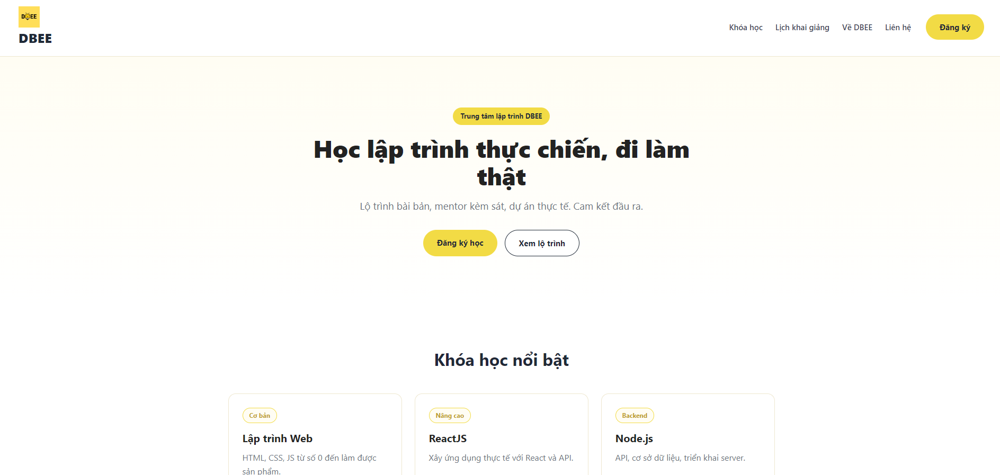
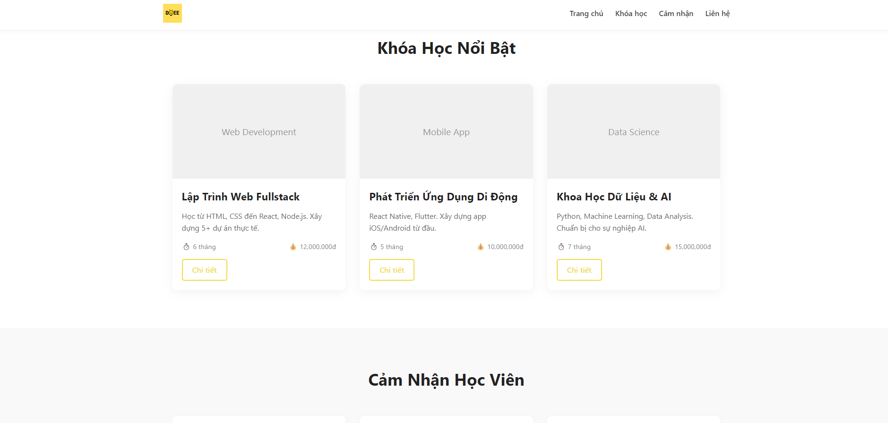
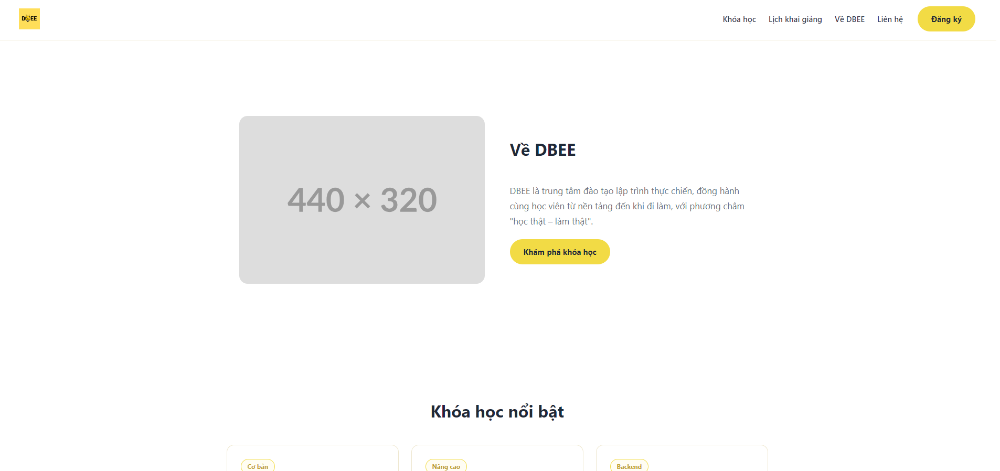
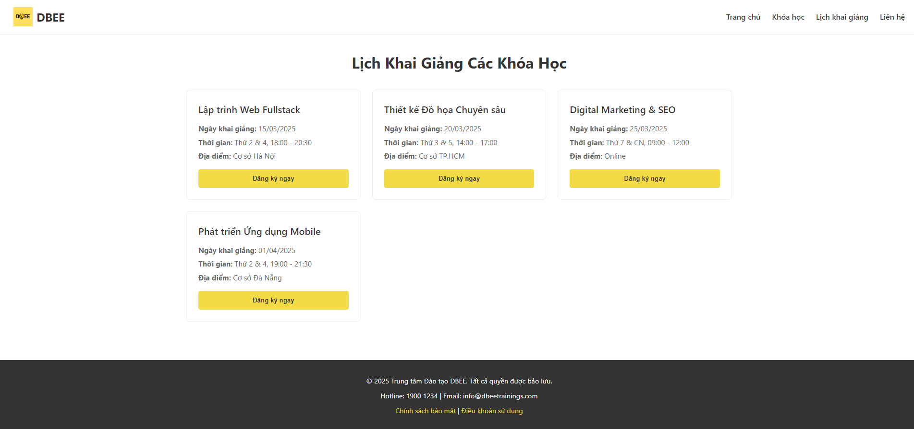
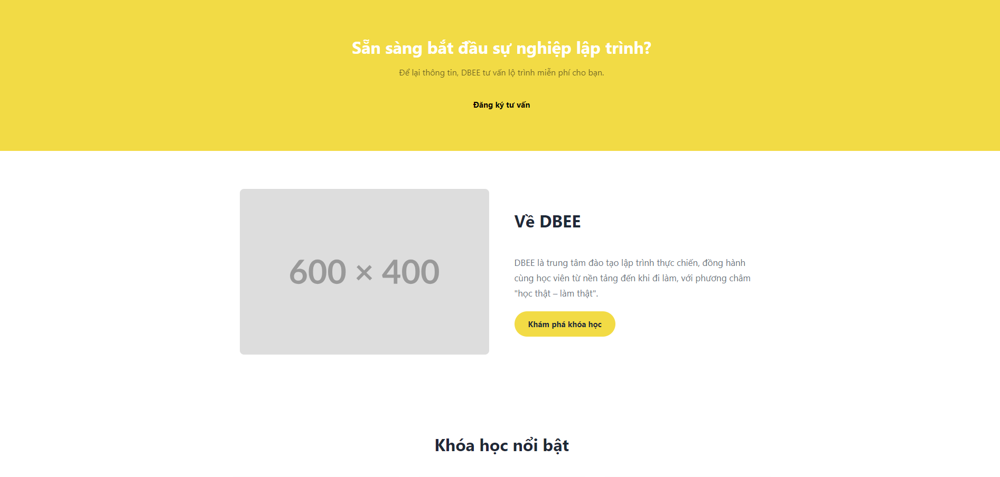
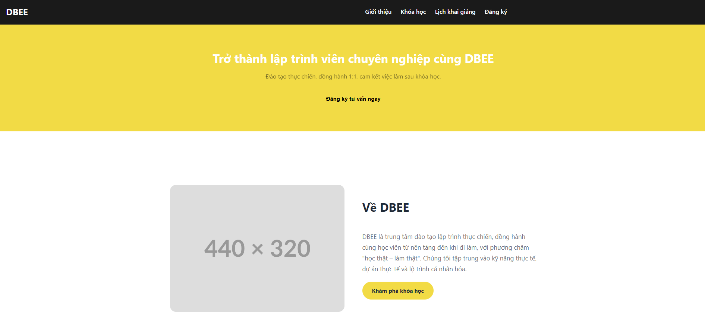
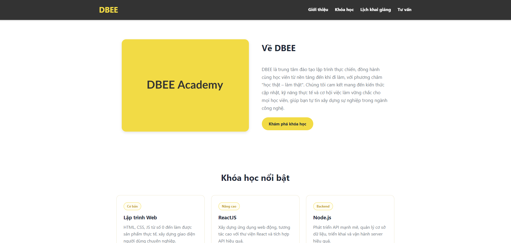
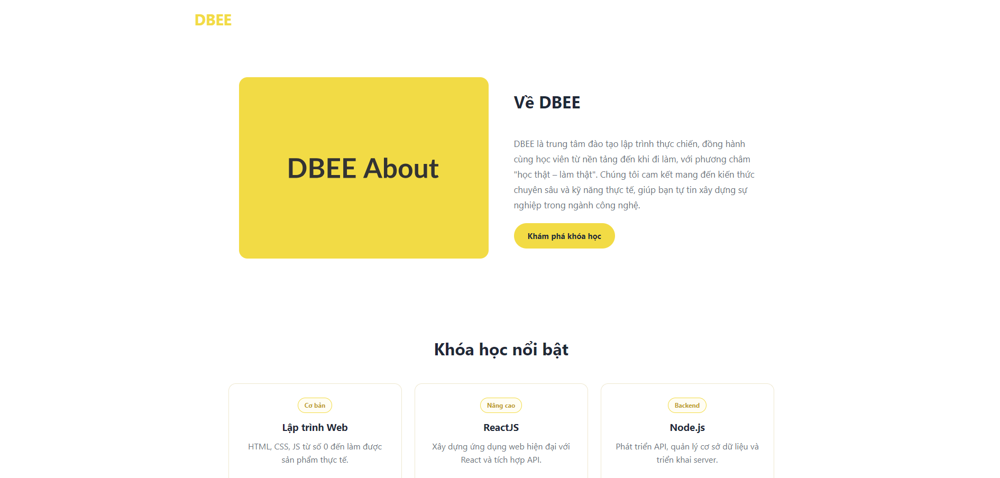
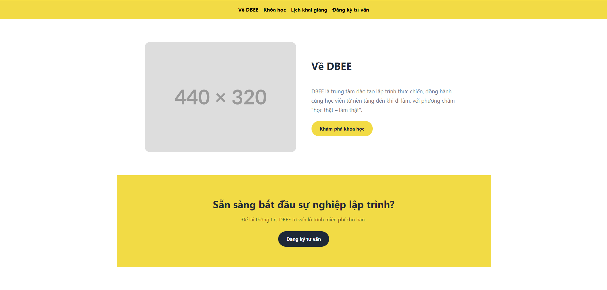
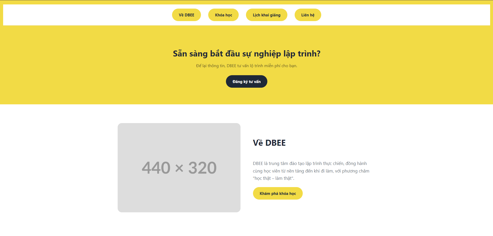

# WebGen — Trợ lý sinh web frontend đa tác tử với Code RAG

**Môn:** IT5380 — Trí tuệ nhân tạo trong Công nghệ phần mềm
**Đề tài:** Multi-Agent AI Pair Programming Assistant for Web Frontend Development with Code RAG
**Định hướng:** *application* · **Mục tiêu:** Mức 3 (nhờ thành phần Code RAG)

> Ghi chú: số liệu Mục 5 lấy từ `npm run eval:models` (chạy thật, `MOCK_MODE=0`, 2026). Ảnh đặt trong
> thư mục `results/`. Thông số kiến trúc mô hình (số tham số, độ dài ngữ cảnh) cần trích từ model card
> chính thức của Qwen — phần này để trống có chủ đích, không điền số phỏng đoán.

---

## 1. Giới thiệu

### 1.1. Bài toán & mục tiêu
Các công cụ như *bolt.new / v0* cho phép mô tả website bằng ngôn ngữ tự nhiên rồi sinh ra mã giao diện chạy
được ngay. WebGen là một phiên bản thu nhỏ của lớp công cụ đó: người dùng mô tả website (tiếng Việt hoặc Anh)
→ hệ thống **sinh mã frontend** → **preview ngay trong trình duyệt** → **chỉnh sửa qua hội thoại**.

**Vấn đề cốt lõi.** Một LLM sinh mã "trần" có thể tạo trang hợp lệ, nhưng đầu ra **thiếu nhất quán**: mỗi lần
sinh lại ra một phong cách khác, nhiều trang của *cùng một website* trông như của các website khác nhau. Với
bài toán làm web cho một thương hiệu, **tính nhất quán nhận diện** mới là yêu cầu thực sự khó.

**Mục tiêu đồ án.** Xây dựng trợ lý sinh web trong đó **Code RAG** (Retrieval-Augmented Generation cho mã) là
thành phần lõi: truy xuất các *component giao diện* từ một kho tri thức rồi nhồi vào prompt, để đầu ra **bám
sát một bộ thiết kế thống nhất**, giảm "bịa", và ổn định "vibe" qua nhiều lần sinh. Đây là thành phần quyết
định **Mức 3**: hệ thống không chỉ gọi LLM mà còn có **lớp tri thức ngoài + truy xuất ngữ nghĩa + tăng cường sinh**.

**Đóng góp chính:**
1. **Pipeline nhiều tác tử trên một điểm điều phối duy nhất** (`pipeline.js`), trong đó **Code Agent** và
   **Review Agent** là tác tử thật dùng LLM theo mẫu *producer–critic*.
2. **Code RAG** với embedding **cục bộ, miễn phí, đa ngôn ngữ** + kho component **mở rộng được lúc chạy** (CRUD).
3. **"Design system DBEE":** kho component dùng chung nhận diện + **theme cố định** chèn sau khi sinh → ổn định vibe.
4. **Đánh giá thực nghiệm** so 3 LLM trên cùng pipeline + cùng RAG, dùng chỉ số grounding/ổn định và
   **LLM-as-Judge trung lập**.

**Quyết định kiến trúc.** Đầu ra là **HTML/CSS/JS thuần, một file `/index.html` tự chứa**; preview bằng
**iframe cục bộ** (không phụ thuộc bundler ngoài, chạy offline khi demo).

---

## 2. Kiến trúc hệ thống

### 2.1. Tổng quan (frontend – backend – pipeline)
```
        ┌──────────────── Frontend (React + Vite + Tailwind) ────────────────┐
 Người  │ ChatPanel · BrandPanel · ComponentPanel (CRUD kho RAG)             │
 dùng ─▶│ PreviewPanel (iframe) · CodeViewer (Monaco) · AgentSteps           │
        └───────────────┬────────────────────────────────────────────────────┘
                        │ HTTP JSON  (/api/generate, /api/edit, /api/brands, /api/components)
        ┌───────────────▼──────────────── Backend (Node ≥18 / Express, ESM) ──┐
        │ index.js (REST)                                                       │
        │ pipeline.js — ĐIỂM ĐIỀU PHỐI DUY NHẤT của các tác tử                  │
        │   Resolve brand → RAG Agent → Code Agent → Review Agent               │
        │                              → inline logo → chèn theme DBEE          │
        │ rag/* (embed · store · retrieve)   qwenClient.js   review.js          │
        └───────────────────────────────────────────────────────────────────────┘
```
- **Frontend:** React + Vite + Tailwind; **Monaco Editor** (cấu hình chạy cục bộ/offline) để sửa mã; **JSZip**
  để export `.zip`; preview bằng **iframe** dựng từ chuỗi HTML (không CDN).
- **Backend:** Express (ESM); một client model **OpenAI-compatible**; **parser JSON phòng thủ**.
- **RAG:** `@xenova/transformers` (embedding cục bộ) + vector store *memory* (cosine) hoặc **Chroma**.

### 2.2. Quy trình đa tác tử
`pipeline.js` là **điểm điều phối duy nhất**; các tác tử phối hợp **tuần tự**, mỗi tác tử/bước trả về một phần
tử `agentSteps` để frontend hiển thị tiến trình. Các thành phần đã hiện thực:

| Bước | Thành phần | Vai trò |
|---|---|---|
| 1 | Tiếp nhận & nhận diện | Nhận mô tả người dùng, *resolve brand* (màu/font/logo) dùng cho cả truy xuất lẫn prompt |
| 2 | **RAG Agent** | Truy xuất top-k component theo ngữ nghĩa (Mục 4); có **fallback**: store lỗi vẫn sinh được mã |
| 3 | **Code Agent** (LLM) | Gọi Qwen3-Coder-Next sinh JSON `{summary, entry, files}` |
| 4 | **Review Agent** (LLM) | Soát HTML tĩnh → nếu lỗi thì **tự gọi LLM sửa 1 vòng** rồi soát lại |
| 5 | Hậu xử lý | Thay placeholder logo bằng ảnh thật; chèn **theme DBEE** cố định để đồng nhất giao diện |

Đóng góp *agentic* rõ nhất là cặp **Code Agent (producer) → Review Agent (critic tự sửa)**: Review không chỉ báo
lỗi mà **ra quyết định và hành động** — phát hiện lỗi → gọi mô hình sửa → kiểm lại; nếu vẫn lỗi thì giữ bản tốt
hơn. **RAG Agent** cung cấp tri thức nền (component) cho Code Agent. Việc gom mọi tác tử về **một điểm điều phối**
giúp luồng dễ quan sát (qua `agentSteps`) và dễ mở rộng.

**Review Agent (`review.js`)** kiểm các lỗi tĩnh: thiếu khung `<html>/<body>`, lệch `<script>/<style>`, output
bị cắt cụt, còn `TODO`, dùng CDN ngoài. Có lỗi *error* → gọi `buildFixMessages` cho LLM sửa; luôn có fallback
giữ bản gốc nếu sửa thất bại (không bao giờ chặn pipeline).

### 2.3. API & định dạng đầu ra
Hợp đồng interface cố định ở `docs/API_CONTRACT.md`:

| Endpoint | Vào | Ra |
|---|---|---|
| `POST /api/generate` | `{ description, language, brandId }` | `ProjectResult` |
| `POST /api/edit` | `{ files, instruction, language }` | `ProjectResult` |
| `GET/POST /api/brands` | brand `{name, colors, font, logo}` | danh sách / brand mới |
| `GET/POST/PUT/DELETE /api/components` | component người dùng | thống kê / id |
| `GET /api/health` | — | trạng thái + model |

`ProjectResult = { summary, entry:"/index.html", files:[{path,content}], agentSteps:[{agent,status,summary}], meta }`.
**Mô hình bắt buộc trả về duy nhất một JSON** `{summary, entry, files}` (ràng buộc trong *OUTPUT_RULES* của
system prompt). Tầng nhận kết quả **phòng thủ**: `parser.js` bóc JSON kể cả khi mô hình lỡ bọc ```` ```json ````
hay kèm lời dẫn, chuẩn hóa `path`, chọn `entry`; lỗi parse trả `502` kèm raw để gỡ.

---

## 3. Mô hình sinh mã Qwen3-Coder-Next

### 3.1. Tổng quan kiến trúc, kỹ thuật của mô hình
**Qwen3-Coder** là dòng **LLM chuyên cho lập trình** thuộc hệ Qwen, **open-weight**, tinh chỉnh theo chỉ thị
(*instruction-tuned*) cho: sinh mã, chỉnh sửa mã, hiểu mã mức kho (repo-level), điền-vào-giữa (fill-in-the-middle)
và **lập trình theo tác tử** (agentic coding). Biến thể dùng trong đồ án là `qwen3-coder-next`, truy cập qua
**DashScope quốc tế** theo chuẩn OpenAI-compatible.

- **Kiến trúc:** Transformer **decoder-only, sinh tự hồi quy (autoregressive)** — sinh **từng token**, mỗi token
  dự đoán dựa trên toàn bộ token trước + prompt; HTML/CSS/JS được "viết dần" tới khi gặp token kết thúc hoặc chạm
  `max_tokens`.
- **Instruction-tuned:** tuân thủ tốt ràng buộc trong *system prompt* (ví dụ "chỉ trả về một JSON").
- **`temperature` thấp (0.2):** phân phối token "nhọn" ⇒ chọn token chắc chắn ⇒ đầu ra **ổn định, lặp lại được** —
  đúng nhu cầu sinh mã.

> 【Trích từ model card/technical report chính thức của Qwen — KHÔNG điền số phỏng đoán】: số tham số (và kiến
> trúc, ví dụ Mixture-of-Experts nếu có), độ dài ngữ cảnh tối đa, điểm benchmark (HumanEval/MBPP/SWE-bench…).

### 3.2. Tích hợp & cấu hình (prompt, JSON mode, max_tokens)
Code Agent gọi mô hình qua `qwenClient.js` (chuẩn `/chat/completions`). **Toàn bộ phụ thuộc nhà cung cấp gói gọn
trong một hàm** — đổi sang OpenRouter/vLLM tự host chỉ cần sửa `.env`, không đụng phần còn lại; hàm còn nhận
*override per-model* (dùng cho so sánh nhiều model ở Mục 5).

| Tham số (`.env`) | Giá trị | Ý nghĩa |
|---|---|---|
| `QWEN_MODEL` | `qwen3-coder-next` | tên model |
| `temperature` | `0.2` | ưu tiên ổn định khi sinh mã |
| `QWEN_MAX_TOKENS` | `32000` | một trang HTML tự chứa rất dài; thấp quá ⇒ **bị cắt cụt** |
| `QWEN_JSON_MODE` | `1` | bật `response_format: json_object` (DashScope/OpenRouter hỗ trợ) |
| `QWEN_TIMEOUT_MS` | `120000` | hủy nếu mô hình treo |

**Kỹ thuật prompt (`codegen.js`):** system prompt ràng buộc *OUTPUT_RULES* (trả **duy nhất** một JSON; HTML/CSS/JS
thuần; một `/index.html` tự chứa; không CDN; không `TODO`). Prompt người dùng = mô tả + (khối nhận diện brand) +
**khối component RAG**.

**Phòng thủ khi nhận kết quả:** `qwenClient.js` phát hiện `finish_reason = "length"` → báo lỗi rõ *"bị cắt cụt,
tăng max_tokens"* thay vì để parser ném lỗi khó hiểu (đây chính là sự cố gặp với một số trang dài khi đánh giá —
xem Mục 5).

---

## 4. Công nghệ Code RAG (trọng tâm)

**Kho tri thức = "design system của DBEE".** Mỗi component là một **snippet HTML/CSS tự chứa**, mô tả bằng
`{ id, name, description, tags, brand?, code }`; `description` viết **giàu từ khóa song ngữ Việt–Anh** (đây là
phần được embed nên quyết định chất lượng truy xuất). Kho gồm **16 component dựng sẵn** dùng chung một nhận diện
(vàng `#f2db45`, font system-ui, bo góc ~12px, quy ước class `dbee-*`) + component **người dùng tự thêm lúc chạy**:

| # | `id` | Vai trò | # | `id` | Vai trò |
|---|---|---|---|---|---|
| 1 | `dbee-navbar` | Thanh điều hướng (logo, menu, nút Đăng ký) | 9 | `dbee-testimonials` | Cảm nhận học viên (trích dẫn + avatar) |
| 2 | `dbee-hero` | Hero tuyển sinh (tiêu đề lớn, CTA) | 10 | `dbee-pricing` | Bảng học phí 3 gói |
| 3 | `dbee-courses` | Lưới khóa học (thẻ: tên, thời lượng) | 11 | `dbee-faq` | Câu hỏi thường gặp (accordion) |
| 4 | `dbee-schedule` | Bảng lịch khai giảng | 12 | `dbee-cta` | Banner kêu gọi đăng ký |
| 5 | `dbee-roadmap` | Lộ trình học 4 bước | 13 | `dbee-register-form` | Form đăng ký/tư vấn |
| 6 | `dbee-features` | "Vì sao chọn DBEE" (3 cột icon) | 14 | `dbee-gallery` | Thư viện ảnh lớp học |
| 7 | `dbee-stats` | Dải số liệu thành tích | 15 | `dbee-about` | Giới thiệu (ảnh + text 2 cột) |
| 8 | `dbee-instructors` | Đội ngũ giảng viên | 16 | `dbee-footer` | Chân trang nhiều cột |

16 component này phủ **mọi section thường gặp của một landing page trung tâm đào tạo**, nên với hầu hết mô tả,
retriever luôn tìm được component phù hợp để ráp trang.

**Phân loại kỹ thuật RAG.** Dự án dùng biến thể phổ biến nhất: **retrieve-then-generate + tăng cường trong ngữ
cảnh (in-context)**. Tri thức là **non-parametric** (nằm ngoài trọng số, không fine-tune — đổi kho không cần
train lại); **single-shot retrieval** (truy xuất một lần trước khi sinh); **dense retrieval** (so khớp ngữ nghĩa
bằng vector, retriever là **bi-encoder**); tài liệu truy xuất là **mã/UI component** (nên gọi là *Code* RAG).

### 4.1. Luồng RAG (index offline · truy xuất online)
```
   (offline, 1 lần — npm run build:rag)              (online, mỗi lần sinh)
 kho component ─buildEmbedText─▶ embed ─▶ VECTOR STORE ◀─ embedText(mô tả người dùng)
 (16 built-in + user-components)          │  query(top-k, {brand})
                                          ▼
                top-k hits ─(lọc/boost brand · re-rank)─▶ nhồi vào prompt ─▶ Code Agent
```
- **Index offline:** `buildEmbedText(c) = "{name}. {description}. tags: {tags}"` → embed toàn kho → nạp store.
- **Truy xuất online:** embed truy vấn → lấy top-k → ghép vào prompt Code Agent.

### 4.2. Embedding (cục bộ, miễn phí, đa ngôn ngữ)
- Thư viện **`@xenova/transformers`** (Transformers.js) chạy hẳn trong Node — **không gọi API, không tốn phí**;
  lần đầu tải model về cache, sau đó offline.
- Mô hình **`Xenova/paraphrase-multilingual-MiniLM-L12-v2`**, vector **384 chiều**, họ Sentence-Transformers/MiniLM
  (encoder 12 lớp, chưng cất tri thức, huấn luyện trên dữ liệu *paraphrase đa ngôn ngữ* ≈50+ thứ tiếng, có tiếng Việt).
- **Bài học kỹ thuật:** ban đầu dùng model tiếng Anh (`all-MiniLM-L6-v2`) → truy xuất tiếng Việt **kém rõ rệt**
  (vd "bảng giá" không ra component pricing); đổi sang model đa ngôn ngữ thì khớp đúng.

**Pipeline tạo vector (`embed.js`):**
```
text → tokenize → encoder Transformer → embedding theo TỪNG token
     → MEAN POOLING (trung bình có mặt nạ) → vector câu → L2 NORMALIZE → vector 384 chiều
```
Vì đã chuẩn hóa L2 (`normalize:true`), **cosine = tích vô hướng**:

> cos(a, b) = (a · b) / (‖a‖ · ‖b‖)  →  khi ‖a‖ = ‖b‖ = 1 thì cos(a, b) = a · b ∈ [−1, 1]

**Dense vs Sparse.** Sparse (BM25/TF-IDF) khớp **từ khóa** — dễ trượt khi truy vấn và mô tả khác chữ. Dense (đang
dùng) khớp **ý nghĩa**, bắt được đồng nghĩa và **song ngữ Việt–Anh** — đúng nhu cầu vì truy vấn người dùng rất tự do.

### 4.3. Vector store (trừu tượng hóa: memory + Chroma)
`store.js` cung cấp **một giao diện chung** (`addAll/upsertItems/removeItems/query`) với 2 backend, chọn qua `RAG_STORE`:

| Backend | Cơ chế | Khi dùng |
|---|---|---|
| **`memory`** (mặc định) | **NN chính xác** (brute-force cosine với *tất cả* vector), lưu `rag-index.json` | Kho nhỏ (~17 component) → tức thời; không cần cài gì; làm fallback |
| **`chroma`** | Vector DB thật, **ANN qua HNSW** (`hnsw:space: cosine`) | Kho lớn (vạn+) → tìm gần đúng cực nhanh |

Embedding **luôn được truyền sẵn** (Chroma không tự sinh — khai báo embedder *no-op*). Cách trừu tượng hóa này
vừa đảm bảo "luôn có nhánh chạy được" (memory), vừa thể hiện tích hợp vector DB thực thụ (Chroma) theo kiến trúc đã chốt.

### 4.4. Logic truy xuất (`retrieve.js`)
Hàm `retrieveComponents({ description, brandId, k })`:
1. RAG tắt (`RAG_ENABLED=0`) hoặc mô tả rỗng → trả `[]`.
2. `topK = RAG_TOP_K` (mặc định **6** — đủ phủ nhiều section của một trang).
3. `embedText(description)` → vector truy vấn (384 chiều, đã chuẩn hóa).
4. `store.query(queryVec, fetchK, {brand})` — **lọc theo brand:** không brand → **chỉ component dùng chung**
   (ẩn component riêng brand khác); có brand → **dùng chung + đúng brand đó** (lấy dư `fetchK = topK+6`).
5. **Cộng điểm ưu tiên brand:** hit đúng brand +`RAG_BRAND_BOOST` (mặc định **+0.15**) → **sắp lại** → cắt **top-k**.
   *Lưu ý trung thực:* kho hiện **thuần DBEE (generic, không gắn brand)** để *mọi* prompt đều ra vibe DBEE, nên
   nhánh boost/lọc-brand **chưa kích hoạt thực tế** — nó **sẵn sàng** cho việc về sau có nhiều bộ component theo thương hiệu.
6. Trả `{ id, name, description, tags, code, score }`.

### 4.5. Tăng cường sinh + design system DBEE (ổn định vibe)
**Vấn đề:** nhồi component "thô" (kèm `<style>`) khiến mô hình **vẽ lại CSS** mỗi lần ⇒ lệch cỡ chữ navbar, bo
góc, footer giữa các trang. **Giải pháp hai lớp — tách CẤU TRÚC khỏi STYLE:**

1. **Nhồi cấu trúc, cấm style (`codegen.js`):** khi ghép component vào prompt, `stripStyle()` **bỏ khối `<style>`**;
   prompt yêu cầu *"dùng đúng class `dbee-*`, KHÔNG viết lại CSS cho class `dbee-*`"*. Mô hình chỉ **ráp HTML**.
   ```
   === DESIGN SYSTEM DBEE (BẮT BUỘC) ===
   - Ráp trang bằng các MẪU HTML dưới đây, DÙNG ĐÚNG class dbee-*.
   - KHÔNG viết lại CSS cho class dbee-* (style đã cố định trong theme).
   # <name>
   <HTML cấu trúc, không có style>
   ```
2. **Chèn theme chuẩn xác định (`pipeline.applyTheme`):** sau khi sinh, chèn **một bộ CSS chuẩn duy nhất**
   (`dbeeTheme.js`) cho mọi class `dbee-*` vào **cuối `<head>`** (đánh dấu `data-dbee-theme`, đặt cuối nên **thắng
   cascade** nếu mô hình lỡ viết trùng).

⇒ **Cấu trúc do RAG gợi ý (mềm), style được cấp cố định (cứng)** ⇒ navbar/logo/footer **giống hệt** giữa các trang.
Đây là cách "siết" vượt ngoài RAG cổ điển để **ổn định vibe** — và là yếu tố tạo nên kết quả 100% ở các chỉ số cơ
bản tại Mục 5.

**Tài nguyên & cá nhân hóa.** Logo ảnh **không** nhồi base64 vào prompt (mô hình không chép lại nổi + tốn token +
dễ cắt cụt); thay bằng **placeholder `__BRAND_LOGO__`** rồi pipeline **thay bằng ảnh thật sau khi sinh**
(`inlineBrandLogo`). Người dùng cuối **Thêm/Sửa/Xóa component lúc chạy** (`/api/components`): validate → lưu
`user-components.json` → **embed riêng** → **upsert/remove thẳng vào store** (không build lại toàn bộ); dữ liệu
sống sót qua khởi động lại và qua `build:rag`.

---

## 5. Đánh giá thực nghiệm

Thực nghiệm gồm hai phần bổ trợ nhau: **(5.1–5.3) so sánh giữa các mô hình** trên cùng pipeline + cùng RAG, và
**(5.2) thí nghiệm grounding/nhất quán đa trang** với brand DBEE. Trọng tâm bài toán là **tính nhất quán "vibe"
khi sinh lặp lại**, nên ngoài chỉ số RAGAS trong tài liệu, nhóm bổ sung **chỉ số ổn định phái sinh** và **giám
khảo LLM**. Các chỉ số được nêu rõ nguồn gốc để minh bạch:

| Chỉ số | Nguồn | Ý nghĩa |
|---|---|---|
| **Correct%** | RAGAS (tài liệu) — *Correctness* | Trang hợp lệ (`entry=/index.html`, đủ nội dung) |
| **Lỗi%** | — | Tỉ lệ gọi model thất bại (rate-limit/timeout/cắt cụt) |
| **Reuse** | **proxy do nhóm thiết kế** | Số component RAG được tái dùng TB (≥2 class `dbee-*` trùng) — đại diện *mức tận dụng ngữ cảnh truy xuất*; **không phải** Faithfulness RAGAS chuẩn (claim-based) |
| **AnsRel%** | RAGAS (tài liệu) — *Answer Relevancy* | Độ phủ thành phần yêu cầu (nav/list/form/giá/CTA…) |
| **Stab-Jac% / Stab-Cos%** | **phái sinh (nhóm)**, dựa trên *similarity* (tài liệu) | Độ giống nhau giữa **2 lần gen cùng prompt** — Jaccard trên class CSS / cosine embedding |
| **Judge / VibeJ** | *LLM-as-Judge* (tài liệu) | Giám khảo chấm 1–5: chất lượng trang (Judge) và độ nhất quán vibe giữa 2 lần gen (VibeJ) |

### 5.1. Phương pháp so Qwen với các mô hình free khác
So **3 LLM** trên **cùng pipeline + cùng RAG** (cùng 17 component, cùng theme DBEE) — chỉ thay mô hình sinh, mọi
yếu tố khác giữ nguyên để **cô lập năng lực mô hình**. Cấu hình ở `eval-models.config.js`; **chỉ cần thêm API key
vào `.env`** là thêm được model; mọi model gọi qua chuẩn **OpenAI-compatible** (kèm cờ override `maxTokens/jsonMode/
tokenParam/omitTemperature` cho từng nhà cung cấp).

- **Thí sinh (free):** **Qwen3-Coder-Next** (DashScope), **Gemini 2.5 Flash** (Google AI Studio), **gpt-oss-120b**
  (Cerebras).
- **Quy trình:** mỗi model sinh 3 prompt (trang chủ / học phí / đăng ký); riêng prompt trang chủ **gen 2 lần** để
  đo ổn định (Stab + VibeJ).
- **Giám khảo trung lập (LLM-as-Judge):** để tránh *self-enhancement bias*, giám khảo là **GLM-4.7** (Zhipu/Z.ai
  qua Cerebras) — **không** thuộc nhóm thí sinh. Chấm **blind** (chỉ nhận HTML), `temperature=0`, kèm chốt chặn
  *tự loại* nếu trùng model dự thi. *Lưu ý độ tin cậy:* mỗi điểm Judge dựa trên một lượt chấm — nên đọc như
  **chỉ báo định hướng**, không phải con số tuyệt đối.

### 5.2. Grounding & nhất quán đa trang (thí nghiệm brand DBEE)
"Grounding" ở đây = đầu ra có **bám vào kho tri thức** (tái dùng component DBEE) hay tự bịa. Để bộc lộ, dùng **mô
hình tốt nhất (Qwen)** sinh **hai trang cùng site DBEE** — *trang chủ* và *lịch khai giảng* — ở **hai chế độ**:
có-RAG (`RAG_ENABLED=1`, truy xuất component + chèn theme) và không-RAG (`RAG_ENABLED=0`, mô hình tự do). So sánh
**trực quan** (khác biệt nằm ở *nhận diện & độ đồng bộ* — thứ chỉ số khó phản ánh đầy đủ).

**Trang chủ — có RAG vs không RAG:**

| Có RAG (đúng nhận diện DBEE) | Không RAG (style tự do) |
|---|---|
|  |  |

**Trang lịch khai giảng — có RAG vs không RAG:**

| Có RAG | Không RAG |
|---|---|
|  |  |

**Nhận xét.** *Có RAG:* hai trang dùng chung navbar, footer, nút, bảng màu vàng `#f2db45`, font, quy ước `dbee-*`
⇒ trông như **cùng một website DBEE**. *Không RAG:* mỗi trang một phong cách riêng (màu, bố cục, kiểu nút khác
nhau), **không** có nhận diện chung ⇒ như hai website rời rạc. Đây là **giá trị cốt lõi của Code RAG**: không chỉ
giúp sinh đúng, mà **ràng buộc đầu ra vào một bộ thiết kế thống nhất** — điều LLM "trần" không tự đảm bảo.

### 5.3. Kết quả

| Model | Correct% | Lỗi% | Reuse | AnsRel% | Stab-Jac% | Stab-Cos% | Judge | VibeJ |
|---|---|---|---|---|---|---|---|---|
| **Qwen3-Coder-Next** | 100 | 0 | 13.0 | 100 | **93.3** | **97.7** | 3.7 | **4** |
| **Gemini 2.5 Flash** | 100 | 0 | 12.7 | 100 | 72.7 | 95.6 | 3.7 | 3 |
| **gpt-oss-120b** | 100 | 0 | 12.7 | 100 | 83.3 | 96.4 | 2.7 | **4** |

*Nhận xét giám khảo (blind):*
- **Qwen** — Judge 3.7 (rel 4·design 4·code 3): *thiếu section "Lộ trình", thiếu thẻ Header/Footer dù có CSS, 2 khối CSS trùng*. VibeJ 4/5: *2 lần gen cùng component/màu/typography, chỉ khác bố cục*.
- **Gemini** — Judge 3.7 (rel 4·design 4·code 3): *thiếu Hero và "Lộ trình", CSS dư class không dùng*. VibeJ **3/5**: *một lần gen đổi Header/CTA sang nền tối `#333`, lần kia giữ theme vàng* — kém ổn định nhất.
- **gpt-oss** — Judge **2.7** (rel 3·design 3·code 2): *HTML không khớp CSS (class `dbee-*` không dùng → vỡ giao diện), form thiếu label*. VibeJ 4/5: *cùng hệ màu/typography, chỉ khác thứ tự section*.

**Minh họa — 2 lần gen liên tiếp của mỗi model** (cùng prompt trang chủ; nhìn để cảm nhận độ ổn định vibe):

| Model | Lần gen 1 | Lần gen 2 |
|---|---|---|
| Qwen3-Coder-Next |  |  |
| Gemini 2.5 Flash |  |  |
| gpt-oss-120b |  |  |

**Đọc kết quả:**
- **Mọi model đều 100% Correct & AnsRel, 0% lỗi** — vì **theme DBEE cố định + RAG san bằng** chất lượng cơ bản
  (chính là tác dụng grounding ở §5.2). Các chỉ số "sàn" này vì thế **không** phân biệt được model.
- Khác biệt lộ ra ở **ổn định vibe** (trọng tâm đồ án): **Qwen nhất quán nhất** (Stab-Jac 93.3, VibeJ 4);
  **Gemini kém ổn định nhất** (Stab-Jac 72.7, VibeJ 3 — đổi cả tông màu giữa 2 lần gen).
- **gpt-oss** ổn định nhưng **chất lượng mã thấp nhất** (Judge 2.7) do không tuân thủ tốt class của design-system.
- ⇒ **Qwen3-Coder-Next phù hợp nhất** (cân bằng chất lượng + ổn định), củng cố lựa chọn ở Mục 3.

---

## 6. Kết luận & hướng phát triển

**Kết luận.** WebGen sinh được website thật từ mô tả, preview/sửa ngay trong trình duyệt, với **Code RAG** là lõi:
kho 16 component design-system DBEE + **embedding cục bộ đa ngôn ngữ** + **vector store memory/Chroma** + **truy
xuất top-k có lọc/ưu tiên brand** + **tăng cường prompt tách cấu trúc–style** kèm **theme cố định**. Thực nghiệm
cho thấy RAG **đồng bộ hóa nhận diện đa trang** (§5.2) và **Qwen3-Coder-Next** là mô hình ổn định nhất trong 3 model
free thử nghiệm (§5.3). Về đa tác tử, hệ thống đạt mức **producer–critic thật** (Code + Review).

**Hạn chế (trung thực).**
- **Reuse** là proxy của Faithfulness, chưa phải Faithfulness RAGAS chuẩn (claim-based).
- Điểm **Judge** dựa trên một lượt chấm/model nên chỉ mang tính định hướng.
- Theme cố định khiến chỉ số chất lượng cơ bản bão hòa — khó phân biệt model bằng các chỉ số "sàn".

**Hướng phát triển.** (1) Cài **Faithfulness RAGAS chuẩn** bằng giám khảo (tách claim → kiểm grounding).
(2) Bổ sung **VLM chấm screenshot** để đánh giá thẩm mỹ. (3) Mở rộng kho nhiều brand, kích hoạt nhánh
boost/lọc-brand đã dựng sẵn. (4) Re-ranking / tách truy vấn theo section cho mô tả phức tạp.

---

## Tài liệu tham khảo

> *Định dạng theo mẫu của môn; kiểm tra lại năm/tác giả/nhà xuất bản trước khi nộp.*

1. **Hai tài liệu môn học** về benchmark + developer study và "list of metrics" (bộ **RAGAS**) — *(điền nguồn do giảng viên cung cấp)*.
2. Qwen Team. *Qwen3-Coder* — model card / technical report. Alibaba (DashScope/Hugging Face).
3. P. Lewis et al. *Retrieval-Augmented Generation for Knowledge-Intensive NLP Tasks.* NeurIPS, 2020.
4. N. Reimers, I. Gurevych. *Sentence-BERT: Sentence Embeddings using Siamese BERT-Networks.* EMNLP, 2019.
5. W. Wang et al. *MiniLM: Deep Self-Attention Distillation for Task-Agnostic Compression of Pre-Trained Transformers.* NeurIPS, 2020. (model `paraphrase-multilingual-MiniLM-L12-v2`, Hugging Face)
6. S. Es et al. *RAGAS: Automated Evaluation of Retrieval Augmented Generation.* 2023.
7. L. Zheng et al. *Judging LLM-as-a-Judge with MT-Bench and Chatbot Arena.* NeurIPS, 2023.
8. *Chroma* — open-source embedding database. https://www.trychroma.com
9. *Transformers.js (@xenova/transformers)* — Hugging Face. https://huggingface.co/docs/transformers.js

---

### Phụ lục — Tệp/đường dẫn chính
- Mô hình: `server/src/qwenClient.js`, `prompts/codegen.js`, `parser.js`
- RAG: `server/src/rag/{components,embed,store,retrieve,ingest,userComponents,dbeeTheme}.js`, `scripts/build-rag.js`
- Tác tử/Brand: `server/src/{pipeline,review,brands}.js`
- Đánh giá: `server/scripts/{eval-models,rag-compare,test-judge}.js`, `server/eval-models.config.js`
- Ảnh kết quả: `results/{qwen,gemini,gpt-oss}/image{1,2}.png`, `results/rag-on-off/{on,off}-{home,schedule}.png`
- Frontend: `web/src/App.jsx`, `web/src/components/*`, `web/src/monacoSetup.js`
- Hợp đồng & vận hành: `docs/API_CONTRACT.md`, `README.md`, `CLAUDE.md`
